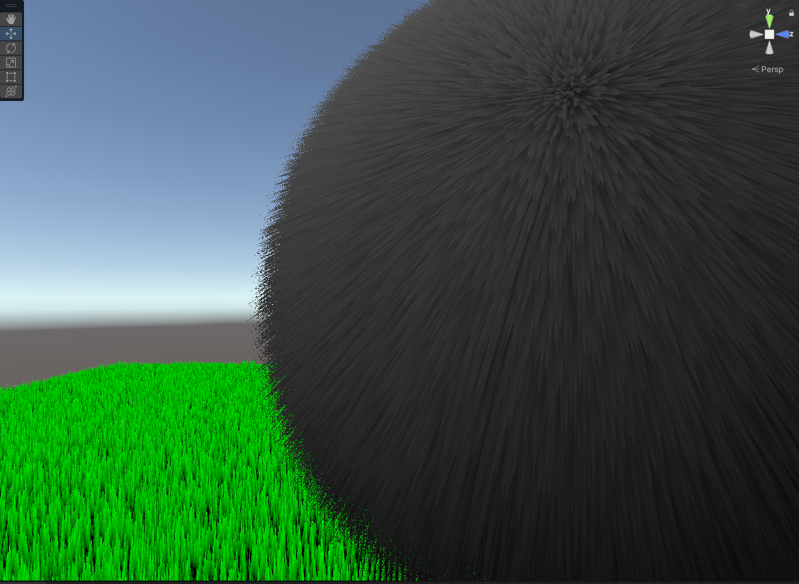

# Tech Demo's Included

This repository showcases a collection of GPU and compute shader-based tech demos.

## 🚀 Features

- **Adding Geometry to Mesh using Compute Shaders**  
  Generate and modify mesh geometry in real time on the GPU, leveraging the power of compute shaders for mesh manipulation.

- **Rendering Million Spheres using GPU Instancing and Making them Interactable using Compute Shaders**  
  Efficiently render millions of spheres with GPU instancing and add interactivity through compute shader-based logic

- **Shell Texturing**  
  Implement shell texturing to simulate fur or grass.
  

  

  <!--  -->

---

